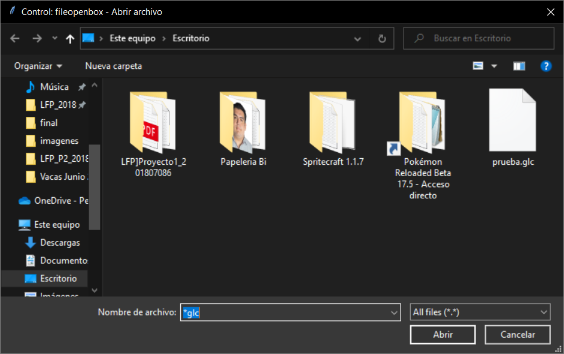

# Manual de Usuario

<h2>Pantalla principal</h2>

Al comenzar el programa nos recibirá una pantalla con los datos del estudiante y se cierra automaticamente despues de 5 segundos y nos mostrará el menú principal.

En este <b>menú</b> podremos escoger entre la opcción de <b>Módulo Grámaticas</b> o <b>Módulo Automatas de Pila</b>.
Al entrar al <b>Módulo Grámaticas</b> nos mostrará la siguiente pantalla.

Al presionar el botón de <b>Cargar Archivo</b> nos motrará la siguiente pantalla:

Donde solo podremos cargar archivos con extension <b>glc</b>.
Al presionar abrir nos aparecerá un mensaje indicando que se cargaron correctamente nuestras grámaticas.
Luego en el menú de <b>Información General</b>, nos mostrará la siguiente pantalla:

Donde al presionar el botón <b>Mostrar Grámaticas</b> nos aparecerá una lista con el nombre de las grámaticas cargadas, al presionar el boton <b>Mostrar Información</b>, nos motrará la información de la grámatica:
, luego podremos regresar al menu anterior mostrado en la [Figura 2](#figura2).
Al entrar en el menú de <b>Arbol de Derivación</b> nos mostrara una pantalla parecida a la de la [Figura 5](#figura5), solo que al presionar nos mostrará un archivo pdf de la siguiente forma:

Luego de eso regresaremos a el menu principal del programa como se muestra en la <b>Figura 2</b>
Ingresaremos al <b>Módulo AP</b>:

Al entrar a la opción de <b>Cargar Archivo</b> nos motrará un menu como en la [Figura 4](#figura4), solo que con la extensión **ap**.
Al presionar en el botón de **Informacion General** nos mostrará una pantalla similar a la [Figura 5](#Figura5), nos motrará los nombres de los AP ingresados al sistema, Al presionar el botón **Mostrar Información** nos abrirá un archivo pdf mostrando la informaión del automata de la siguiente forma:

Luego nos regresaremos al menu de **Módulo AP** y al entrar al menú **Validar Cadena** nos motrará un menú como en la [Figura 5](#Figura5) mostrando los automatas cargados y pidiendonos una cadena a validar, si la cadena es válida nos mostrar un mensaje que fue aceptada, de lo contrario no.
La opción **Ruta de Validación** es lo mismo pero muestra la tabla de transiciones hechas en consola.
En la opción **Validar de una pasada** es basicamente lo mismo solo que mostrará un reporte en pdf como fue avanzando la pila con la cadena ingresada.